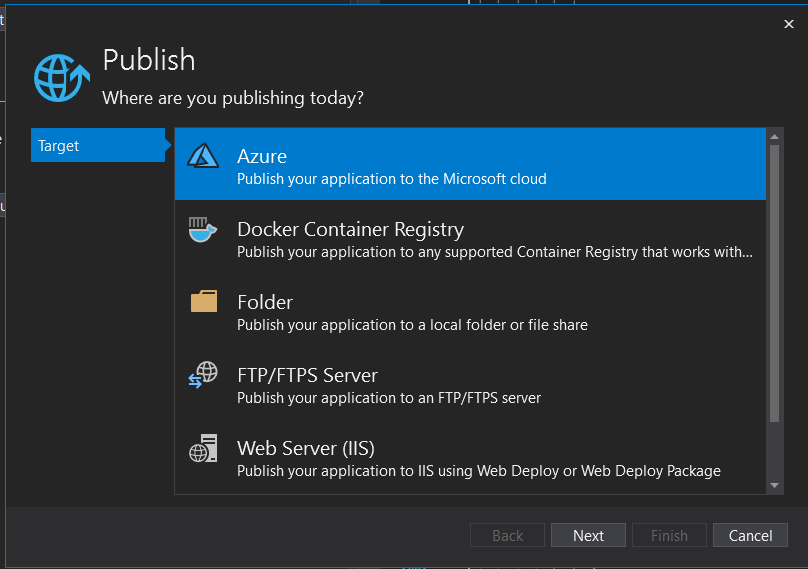
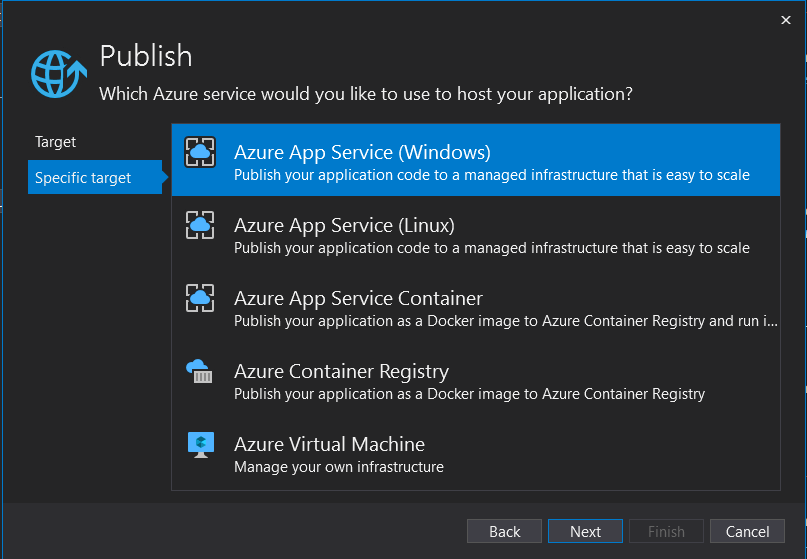

# Deploy ASP.NET Core + Angular 8 app on Microsoft Azure

## Step 1: Change the output path

Go to angular.json and change the "outputPath" from "dist/code-spot-client" to "../wwwroot"

```json
"options" : {
    "outputPath": "../wwwroot",
    ...
}
```

## Step 2: Turn off optimizer (for AlertifyJS to work)
```json
"configurations": {
    ...
    "buildOptimizer": false,
    ...
}
```

## Step 3: Build Angular app

In the code-spot-client folder, run the following command

```shell
ng build --prod
```

Theo output will be in the wwwroot folder

## Step 4: Change Startup.cs (to serve content in wwwroot folder)

Navigate to Startup.cs and add these lines after app.UseHttpsRedirection() in the Configure(IApplicationBuilder app, IHostingEnvironment env) method

```csharp
app.UseStaticFiles();
app.UseDefaultFiles(); // tell Angular to serve index.html in wwwroot folder
```

## Step 5: Create FallbackControler + Config this in Startup.cs

_Note: If we don't do this step, refreshing the Angular app in production would lead to a 404 error._

Code for FallbackControler
```csharp
using System.IO;
using Microsoft.AspNetCore.Mvc;

namespace Code_Spot_P2P.Controllers
{
    public class FallbackController : Controller
    {
        public IActionResult Index()
        {
            return PhysicalFile(Path.Combine(Directory.GetCurrentDirectory(),
                    "wwwroot", "index.html"), "text/HTML");
        }
    }
}
```

Navigate to Startup.cs and add these lines in the Configure(IApplicationBuilder app, IHostingEnvironment env) method

```csharp
app.UseMvc(routes =>
{
    routes.MapSpaFallbackRoute(
        name: "spa-fallback",
        defaults: new {controller = "Fallback", action = "Index"}
    );
});
```

## Step 6: Config Databases 
_Note: This step is required if the local DB is different from the production DB (eg: SQLite for local and SQL Server for production)_

Navigate to Startup.cs and add these methods inside the Startup class

```csharp
// Use SQLite for development (local)
public void ConfigureDevelopmentServices(IServiceCollection services)
{
    services.AddDbContext<DataContext>(x => 
        x.UseSqlite(Configuration.GetConnectionString("DefaultConnection")));

    ConfigureServices(services);
}

// Use SQL Server for production
public void ConfigureProductionServices(IServiceCollection services)
{
    services.AddDbContext<DataContext>(x => 
        x.UseSqlServer(Configuration.GetConnectionString("DefaultConnection")));
        
    ConfigureServices(services);
}

```

## Step 7: Publish ASP.NET Core app

In the code-spot folder, run the following command

```shell
dotnet publish -c Release
```
## Step 8: Set up resource group on Azure

Log in to Azure portal -> When creating resource group, select Web app + SQL

## Step 9: Add your IP address in Azure firewall settings

First, log in to Azure portal.

Go to CodeSpotResourceGroup, select code-spot (SQL server) and then select
_Show firewall settings_

Add your IP address. Fill in _Start IP_ and _End IP_ with your IP address

Now you can use the Query editor (preview) to view and query your production DB

## Step 10: Publish on Azure

Open Visual Studio and click on the project and select _Publish_



Select Azure, then choose either Azure App Service (Windows) or Azure App Service (Linux) based on the type of machine you select in the resource group.



Then, sign in to your Azure Account.

You're all set now. Just click _Publish_!