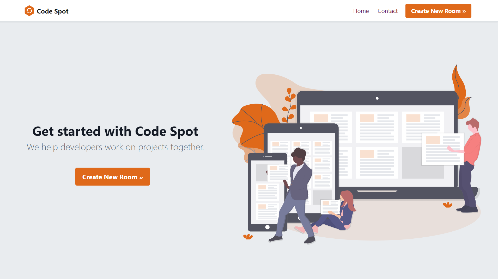

# [Code-Spot](https://code-spot.azurewebsites.net/)

## A real-time collaborative code editor with the power of Visual Studio Code. 




## **I. Check it out [here](https://code-spot.azurewebsites.net/)!**
We also published an article on building a real-time collaborative code editor. Check it out [here](https://medium.com/@dinamoteam01/building-a-real-time-collaborative-code-editor-cb842975652f)!

## **II. Development setup**

1. Download SQLite3
https://sqlite.org/download.html

2. Make sure you have ASP.NET Core 2.1 SDK and runtime: Installs via Visual Studio Installer or downloads at https://dotnet.microsoft.com/download/dotnet-core/2.1

3. Install the .NET Core CLI

```shell
dotnet tool install --global dotnet-ef
```
4. Create the local instance of the DB by running this command in the terminal

```shell
dotnet ef database update
```
Note: to drop the database, run the following command
```shell
dotnet ef database drop
```

5. This project was generated with [Angular CLI](https://cli.angular.io/) version 8.3.9.

Install the Angular CLI using NPM ([Node.js](https://nodejs.org/en/) >= 10 required)

```shell
npm install -g @angular/cli@8.3.9 
```
In the code-spot-client folder. Restore all NPM packages by running

```shell
npm install
```

6. Start IIS Express server through Visual Studio IDE or run this command in the project's folder (Code-Spot-P2P)
```shell
dotnet run
```
7. Run this command in the client's folder (code-spot-client).

```shell
ng serve --open
```
 Navigate to `http://localhost:4200/`. The app will automatically reload if you change any of the source files.